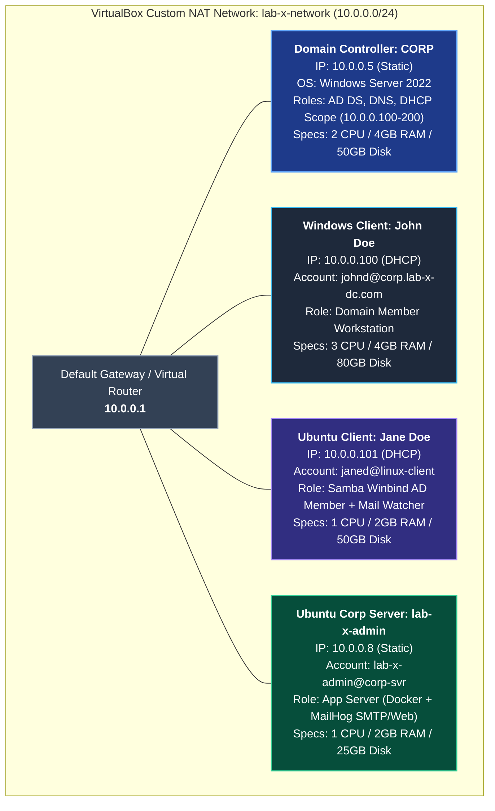

[5 lines collapsed]

## 🏛️ Lab Architecture & Network Topology

                                  [ lab-x-network ]
                             NAT Network: 10.0.0.0/24
                                Gateway: 10.0.0.1
                                        │
      ┌──────────────────┬──────────────┴───────────────┬──────────────────┐
      │                  │                              │                  │
┌─────▼──────────┐ ┌─────▼───────────────┐ ┌────────────▼──────┐ ┌─────────▼──────────────┐
│ Domain Cont.   │ │ Windows Client      │ │ Ubuntu Client     │ │ Ubuntu Corp Server     │
│ CORP           │ │ John Doe (johnd)    │ │ Jane Doe (janed)  │ │ lab-x-admin            │
│ 10.0.0.5       │ │ 10.0.0.100          │ │ 10.0.0.101        │ │ 10.0.0.8               │
│ AD DS, DNS,    │ │ Windows OS          │ │ Ubuntu Linux      │ │ Docker + MailHog       │
│ DHCP Server    │ │ Domain Member       │ │ Samba Winbind AD  │ │ (SMTP: 1025 / UI: 8025)│
└────────────────┘ └─────────────────────┘ └───────────────────┘ └────────────────────────┘
```
---
### 1. Domain Controller (DC)
- **Hostname:** `CORP`
- **Domain Name:** `lab-x-dc` (FQDN: `corp.lab-x-dc.com`)
- **Virtualization Software:** Oracle VM VirtualBox
- **ISO / OS Version:** Windows Server 2025 ISO (Operating System: Windows Server 2022)
- **Hardware Allocation:** 2 Cores CPU, 4 GB RAM, 50 GB Storage
- **Static IP Address:** `10.0.0.5/24`
- **Default Gateway:** `10.0.0.1`
- **Active Server Roles:** Active Directory Domain Services (AD DS), DNS Server, DHCP Server
### 2. Network & Subnet Configuration
- **VirtualBox NAT Network:** `lab-x-network` (`10.0.0.0/24`)
- **Gateway / Virtual Router:** `10.0.0.1`
- **DHCP Scope:** `10.0.0.100` – `10.0.0.200`
- **Primary DNS:** `10.0.0.5` (`CORP.lab-x-dc.com`)
---
## 👥 Provisioned Systems & Accounts
| Hostname / Machine | OS | Hardware Specs | IP Address | Account ID / UPN | Role / Services |
| :--- | :--- | :--- | :--- | :--- | :--- |
| **CORP** | Windows Server 2022 | 2 CPU / 4096 MB RAM / 50 GB Storage | `10.0.0.5` | `Administrator@corp.lab-x-dc.com` | Primary Domain Controller, DNS, DHCP |
| **Windows Client** | Windows Client | 3 CPU / 4096 MB RAM / 80 GB Storage | `10.0.0.100` | `johnd@corp.lab-x-dc.com` | Domain-joined workstation (John Doe) |
| **linux-client** | Ubuntu Desktop 22.04 | 1 CPU / 2048 MB RAM / 50 GB Storage | `10.0.0.101` | `janed@linux-client` | Domain-joined Linux client (Jane Doe) + Mail Watcher |
| **corp-svr** | Ubuntu Server 22.04 | 1 CPU / 2048 MB RAM / 25 GB Storage | `10.0.0.8` | `lab-x-admin@corp-svr` | Corporate Application Server (Docker + MailHog) |
---
### Hardware & Virtual Machine Breakdown
1. **Domain Controller (`CORP`):**
   - **OS:** Windows Server 2022 (Windows Server 2025 ISO)
   - **Hardware Allocation:** 2 CPU Cores, 4096 MB (4 GB) RAM, 50 GB Storage
   - **IP Address:** `10.0.0.5` (Static)
2. **Windows Client (`John Doe`):**
   - **OS:** Windows Client
   - **Hardware Allocation:** 3 CPU Cores, 4096 MB (4 GB) RAM, 80 GB Storage
   - **IP Address:** `10.0.0.100` (DHCP Assigned)
3. **Ubuntu Desktop Client (`linux-client` / `Jane Doe`):**
   - **OS:** Ubuntu Desktop 22.04 LTS
   - **Hardware Allocation:** 1 CPU Core, 2048 MB (2 GB) RAM, 50 GB Storage
   - **IP Address:** `10.0.0.101` (DHCP Assigned)
4. **Ubuntu Corporate Server (`corp-svr` / `lab-x-admin`):**
   - **OS:** Ubuntu Server 22.04 LTS
   - **Hardware Allocation:** 1 CPU Core, 2048 MB (2 GB) RAM, 25 GB Storage
   - **IP Address:** `10.0.0.8` (Static / App Server)
---
## 🐧 Cross-Platform Linux Domain Integration (Samba Winbind + Kerberos)
Ubuntu Linux clients are joined to the Active Directory domain controller using **Kerberos (`krb5-user`)**, **Samba**, and **Winbind**, enabling centralized Active Directory authentication and automatic home directory creation for Linux sessions.
### Step 1: DNS Resolution & Kerberos Configuration
Ensure `/etc/resolv.conf` points directly to the Windows Domain Controller:
```ini
nameserver 10.0.0.5
search corp.lab-x-dc.com
```
Register the domain realm with `krb5-config` / `/etc/krb5.conf`:
```ini
[libdefaults]
    default_realm = CORP.LAB-X-DC.COM
    dns_lookup_realm = false
    dns_lookup_kdc = true
```
### Step 2: Samba & Winbind Configuration (`/etc/samba/smb.conf`)
Configure Samba for Active Directory Security (`ads`) mode and autorid mapping:
```ini
[global]
   kerberos method = secrets and keytab
   realm = CORP.LAB-X-DC.COM
   workgroup = CORP
   security = ads
   template shell = /bin/bash
   winbind enum groups = Yes
   winbind enum users = Yes
   winbind separator = +
   idmap config * : rangesize = 1000000
   idmap config * : range = 1000000-19999999
   idmap config * : backend = autorid
```
### Step 3: Name Service Switch Configuration (`/etc/nsswitch.conf`)
Enable Winbind for user and group lookups:
```text
passwd:         files systemd sss winbind
group:          files systemd sss winbind
```
### Step 4: Automatic Home Directory Generation & Domain Join
Enable PAM home directory creation:
```bash
sudo pam-auth-update --enable mkhomedir
```
Join the Linux client to the Windows Server Domain:
```bash
sudo net ads join -U Administrator
```
Restart and verify services:
```bash
sudo systemctl restart smbd nmbd winbind
wbinfo -u   # Lists AD domain users
wbinfo -g   # Lists AD domain groups
```
---
## 📧 Corporate Mail Infrastructure & Automation Pipeline
The server `corp-svr` (`10.0.0.8`) hosts a mock corporate mail pipeline using **Docker** and **MailHog** (SMTP on port `1025`, Web UI / API on port `8025`).
### 1. Python SMTP Test Email Dispatcher (`corp-svr`)
A Python script sends test transactional email notifications through the local MailHog SMTP relay:
```python
import smtplib
from email.message import EmailMessage
msg = EmailMessage()
msg.set_content("This is a test email from Ubuntu VM.")
msg["Subject"] = "Hello World from MailHog!"
msg["From"] = "corpserver@example.com"
msg["To"] = "user@example.com"
# Connect to MailHog SMTP service
with smtplib.SMTP("localhost", 1025) as server:
    server.send_message(msg)
```
### 2. Automated Mail Watcher & Polling Service (`janed@linux-client`)
On `linux-client` (`10.0.0.101`), Jane Doe runs an automated daemon script that polls the MailHog REST API v2 every 30 seconds, parses JSON payloads using `jq`, tracks seen message IDs, and alerts the user upon receiving new emails:
```bash
#!/bin/bash
MAILHOG_IP="10.0.0.8"  
