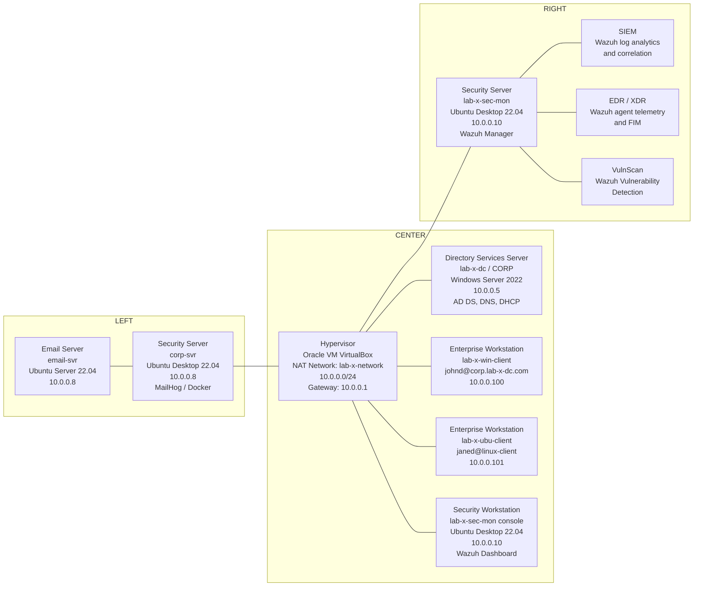

# Active Directory, Linux Integration, and Wazuh Security Lab (VirtualBox)

A hands-on enterprise lab built in Oracle VM VirtualBox. The environment covers Active Directory Domain Services, DNS, DHCP, Linux domain join with Kerberos and Samba Winbind, internal mail services, and centralized security monitoring with Wazuh.

---

## Lab Architecture and Network Topology

The diagram follows the same hub-and-spoke layout as the lab map: a central hypervisor, directory services at the top, security and email services on the left, Wazuh security functions on the right, and workstations along the bottom.



### Topology Node Map

| Diagram box | Lab hostname | IP address | Role |
| :--- | :--- | :--- | :--- |
| Hypervisor | Host machine (VirtualBox) | Gateway `10.0.0.1` | Virtualization host and NAT network router |
| Directory Services Server | `lab-x-dc` / `CORP` | `10.0.0.5` | Active Directory, DNS, DHCP |
| Security Server (left) | `corp-svr` | `10.0.0.8` | Corporate desktop and MailHog Docker host |
| Email Server | `email-svr` | `10.0.0.8` | Dedicated Ubuntu mail backend |
| Security Server (right) | `lab-x-sec-mon` | `10.0.0.10` | Wazuh Manager, Indexer, and Dashboard |
| SIEM | Wazuh module on `lab-x-sec-mon` | `10.0.0.10` | Log collection, correlation, and alerts |
| EDR | Wazuh module on `lab-x-sec-mon` | `10.0.0.10` | Endpoint telemetry, FIM, and response |
| VulnScan | Wazuh module on `lab-x-sec-mon` | `10.0.0.10` | Vulnerability Detection |
| Enterprise Workstation | `lab-x-win-client` | `10.0.0.100` | Domain-joined Windows client (`johnd`) |
| Enterprise Workstation | `lab-x-ubu-client` | `10.0.0.101` | Domain-joined Ubuntu client (`janed`) |
| Security Workstation | `lab-x-sec-mon` console | `10.0.0.10` | Analyst console for the Wazuh Dashboard |

---

### Network and Subnet Summary

| Parameter | Configuration | Details |
| :--- | :--- | :--- |
| VirtualBox network mode | Custom NAT Network | Network name: `lab-x-network` |
| Network subnet | `10.0.0.0/24` | Usable range: `10.0.0.1` to `10.0.0.254` |
| Default gateway | `10.0.0.1` | VirtualBox NAT gateway |
| Primary DNS server | `10.0.0.5` | Domain controller (`lab-x-dc` / `CORP`) |
| DHCP pool | `10.0.0.100` to `10.0.0.200` | Windows Server DHCP role on `CORP` |

---

## Provisioned Systems and Accounts

| Hostname | OS | Hardware specs | IP address | Account | Role |
| :--- | :--- | :--- | :--- | :--- | :--- |
| **lab-x-dc / CORP** | Windows Server 2022 | 2 CPU / 4096 MB RAM / 50 GB | `10.0.0.5` | `Administrator@corp.lab-x-dc.com` | Domain controller, DNS, DHCP |
| **lab-x-win-client** | Windows Client | 3 CPU / 4096 MB RAM / 80 GB | `10.0.0.100` | `johnd@corp.lab-x-dc.com` | Domain-joined Windows workstation |
| **lab-x-ubu-client** | Ubuntu Desktop 22.04 LTS | 1 CPU / 2048 MB RAM / 50 GB | `10.0.0.101` | `janed@linux-client` | Domain-joined Linux client and mail watcher |
| **corp-svr** | Ubuntu Desktop 22.04 LTS | 1 CPU / 2048 MB RAM / 50 GB | `10.0.0.8` | `lab-x-admin@corp-svr` | Corporate desktop and MailHog Docker host |
| **email-svr** | Ubuntu Server 22.04 LTS | 1 CPU / 2048 MB RAM / 25 GB | `10.0.0.8` | `lab-x-admin@email-svr` | Dedicated mail server |
| **lab-x-sec-mon** | Ubuntu Desktop 22.04 LTS | 2 CPU / 4096 MB RAM / 60 GB | `10.0.0.10` | Local admin on the Wazuh host | Wazuh Server, Indexer, and Dashboard |

### Hardware and Virtual Machine Breakdown

1. **Directory Services Server (`lab-x-dc` / `CORP`)**
   - OS: Windows Server 2022 (Windows Server 2025 ISO)
   - Hardware: 2 CPU cores, 4096 MB RAM, 50 GB storage
   - IP: `10.0.0.5` (static)
   - Functions: AD DS, DNS, DHCP scope `10.0.0.100` to `10.0.0.200`

2. **Enterprise Workstation (`lab-x-win-client` / John Doe)**
   - OS: Windows Client
   - Hardware: 3 CPU cores, 4096 MB RAM, 80 GB storage
   - IP: `10.0.0.100` (DHCP)
   - Account: `johnd@corp.lab-x-dc.com`
   - Wazuh agent group: `windows`

3. **Enterprise Workstation (`lab-x-ubu-client` / Jane Doe)**
   - OS: Ubuntu Desktop 22.04 LTS
   - Hardware: 1 CPU core, 2048 MB RAM, 50 GB storage
   - IP: `10.0.0.101` (DHCP)
   - Account: `janed@linux-client`
   - Functions: Samba Winbind domain member and mail watcher
   - Wazuh agent group: `linux`

4. **Security Server, left (`corp-svr`)**
   - OS: Ubuntu Desktop 22.04 LTS
   - Hardware: 1 CPU core, 2048 MB RAM, 50 GB storage
   - IP: `10.0.0.8`
   - Account: `lab-x-admin@corp-svr`
   - Function: Hosts Docker and MailHog (SMTP `1025`, Web UI and API `8025`)

5. **Email Server (`email-svr`)**
   - OS: Ubuntu Server 22.04 LTS
   - Hardware: 1 CPU core, 2048 MB RAM, 25 GB storage
   - IP: `10.0.0.8`
   - Account: `lab-x-admin@email-svr`
   - Function: Dedicated corporate mail backend

6. **Security Server and Security Workstation (`lab-x-sec-mon`)**
   - OS: Ubuntu Desktop 22.04 LTS
   - Hardware: 2 CPU core, 4096 MB RAM, 60 GB storage
   - IP: `10.0.0.10`
   - Function: Wazuh all-in-one install (Manager, Indexer, Dashboard)
   - Install command: `curl -sO https://packages.wazuh.com/4.9/wazuh-install.sh && sudo bash ./wazuh-install.sh -a -i`

---

## Wazuh Overview

Wazuh is an open-source platform that provides extended detection and response (XDR) and Security Information and Event Management (SIEM). It is used to protect cloud, container, and server workloads.

Wazuh includes log data analytics, intrusion and malware detection, file integrity monitoring (FIM), configuration assessment, vulnerability detection, and support for regulatory compliance.

**Extended Detection and Response (XDR):** XDR pulls data from multiple security layers into one platform. Sources can include workstations, servers, cloud environments, and network traffic. The goal is better detection, investigation, and response by looking at patterns and malicious activity in one place. In this lab, Wazuh covers multi-source data collection, threat detection, intrusion detection, incident investigation, and FIM.

**Security Information and Event Management (SIEM):** A SIEM combines log management, threat detection, and incident response. Wazuh collects and analyzes security data from multiple hosts, detects threats in near real time, and supports investigation and response.

Wazuh uses an agent-based model. Agents are installed on workstations, servers, containers, and virtual machines. Those agents send data to the Wazuh server for processing, aggregation, and visualization.

### The Three Main Wazuh Components

1. **Wazuh Indexer:** A scalable full-text search and analytics engine. It indexes logs and stores alerts generated by the Wazuh server.
2. **Wazuh Server:** Analyzes data from the agents. It runs decoders and rules and uses threat intelligence to look for known indicators of compromise (IOCs). It also manages agents and can configure or upgrade them remotely.
3. **Wazuh Dashboard:** The web UI for visualization and analysis. It includes dashboards for threat hunting, compliance, vulnerable applications, FIM, configuration assessment, and cloud events. It is also used to manage Wazuh configuration and monitor status.

In this lab, Wazuh is the central hub for security logging, analysis, defense, and remediation during attack and defend exercises. It is used to watch what happens during initial access, lateral movement, privilege escalation, persistence, and exfiltration.

This project configures Wazuh SIEM, XDR, and File Integrity Monitoring (FIM). The Vulnerability Detection module already has a default configuration.

### Security Implications

A SIEM and XDR stack helps monitor, detect, prevent, and respond to security activity. Many commercial tools work in a similar way. Wazuh was chosen because it is open source and covers a full set of capabilities in one platform.

**Threat detection**
- Event correlation: Wazuh correlates logs from servers, endpoints, and other sources to find brute-force attempts, privilege escalation, and suspicious logins.
- Real-time alerts: Wazuh can alert on unauthorized access, malware signs, and other anomalies so response can start quickly.

**Proactive defense**
- Intrusion detection: Wazuh acts as a host-based intrusion detection system (HIDS). It watches file integrity, log integrity, and unauthorized changes.
- Endpoint visibility: As part of XDR, it collects endpoint data that can show fileless malware, lateral movement, and ransomware activity.

**Incident response and investigation**
- Automated responses: Wazuh can trigger actions such as blocking an IP or running a script to isolate a host.
- Forensics and data collection: Stored logs help retrace attack steps, identify the entry path, and estimate impact.

**Centralized security management**
- Single UI: Data from multiple hosts is viewed in one dashboard.
- Integration: Wazuh can work with threat intelligence feeds, vulnerability data, and other security tools.

**Threat hunting**
- Behavioral analysis: Analysts can look for unusual system and network behavior.
- Custom rules: Detection rules can be written for this lab's specific hosts and attack paths.

### Wazuh Agent Deployment

There are two main ways to manage agent configuration:

1. **Centralized configuration (`agent.conf`)**
   Changes are made on the Wazuh manager and applied to agents. This file is used for log collection, shared settings, and active response policy. This is the method used in this lab.

2. **Local configuration (`ossec.conf`)**
   Each agent can have its own local file. That is useful for one-off hosts, but it is harder to keep consistent across many agents.

When both files are present, the settings are merged. The last matching setting in `agent.conf` wins. Shared `agent.conf` settings overwrite conflicting local settings.

### Lab Install and Agent Onboarding

Wazuh was installed on `lab-x-sec-mon` (`10.0.0.10`) with:

```bash
curl -sO https://packages.wazuh.com/4.9/wazuh-install.sh && sudo bash ./wazuh-install.sh -a -i
```

Agents were added from the Wazuh GUI:

1. Open **Server Management**
2. Open **Endpoint Summary**
3. Select **Deploy new agent**
4. Generate and run the install script on each host

Enrolled endpoints:

| Host | Account / identity | Agent group |
| :--- | :--- | :--- |
| `lab-x-dc` | `Administrator` | `windows` |
| `lab-x-win-client` | `johnd` | `windows` |
| `lab-x-ubu-client` | `janed` | `linux` |

Two agent groups were created (`windows` and `linux`). Each host was assigned to the matching group.

Custom logs were added through the Wazuh GUI by editing the shared `agent.conf` for each group.

**Windows group (`windows`)**

```xml
<agent_config>
  <!-- Shared agent configuration here -->
  <localfile>
    <location>Security</location>
    <log_format>eventchannel</log_format>
  </localfile>
  <localfile>
    <location>Application</location>
    <log_format>eventchannel</log_format>
  </localfile>
</agent_config>
```

**Linux group (`linux`)**

```xml
<agent_config>
  <localfile>
    <log_format>syslog</log_format>
    <location>/var/log/auth.log</location>
  </localfile>
  <localfile>
    <log_format>syslog</log_format>
    <location>/var/log/secure</location>
  </localfile>
  <localfile>
    <log_format>audit</log_format>
    <location>/var/log/audit/audit.log</location>
  </localfile>
</agent_config>
```

### Why These Logs Are the First Ones to Collect

These logs are a practical starting point because they cover identity, privilege use, and process or service changes without drowning the SIEM in low-value noise.

**Windows Security and Application logs**
- Security: logon and logoff, failed logons, account lockouts, group membership changes, privilege use, and process creation. These are the first places to look for brute force, stolen credentials, and privilege escalation.
- Application: service crashes, installer activity, and application errors. These often show up when malware, packers, or broken persistence mechanisms run.

**Linux `auth.log`, `secure`, and `audit.log`**
- `auth.log` (Debian and Ubuntu) and `secure` (RHEL-style hosts): SSH logons, sudo use, user creation, and PAM events. These are the main sources for failed SSH, sudo abuse, and new local accounts.
- `audit.log`: kernel audit records for file access, command execution, and policy changes. This is useful when you need more than syslog, such as who changed a binary or who ran a privileged command.

Collecting these first gives coverage of authentication, authorization, and host integrity. Broader channels (Sysmon, PowerShell, firewall, web logs) can be added later once the baseline is stable.

---

## Linux Domain Integration (Samba Winbind and Kerberos)

Ubuntu clients are joined to the Active Directory domain using Kerberos (`krb5-user`), Samba, and Winbind. This allows domain authentication and automatic home directory creation on Linux.

### Step 1: DNS and Kerberos

Point `/etc/resolv.conf` at the domain controller:

```ini
nameserver 10.0.0.5
search corp.lab-x-dc.com
```

Register the realm in `/etc/krb5.conf`:

```ini
[libdefaults]
    default_realm = CORP.LAB-X-DC.COM
    dns_lookup_realm = false
    dns_lookup_kdc = true
```

### Step 2: Samba and Winbind (`/etc/samba/smb.conf`)

```ini
[global]
   kerberos method = secrets and keytab
   realm = CORP.LAB-X-DC.COM
   workgroup = CORP
   security = ads
   template shell = /bin/bash
   winbind enum groups = Yes
   winbind enum users = Yes
   winbind separator = +
   idmap config * : rangesize = 1000000
   idmap config * : range = 1000000-19999999
   idmap config * : backend = autorid
```

### Step 3: Name Service Switch (`/etc/nsswitch.conf`)

```text
passwd:         files systemd sss winbind
group:          files systemd sss winbind
```

### Step 4: Home Directories and Domain Join

```bash
sudo pam-auth-update --enable mkhomedir
sudo net ads join -U Administrator
sudo systemctl restart smbd nmbd winbind
wbinfo -u
wbinfo -g
```

---

## Corporate Mail Infrastructure

The mail path uses Docker and MailHog (SMTP on port `1025`, Web UI and API on port `8025`).

### Python SMTP test from `corp-svr`

```python
import smtplib
from email.message import EmailMessage

msg = EmailMessage()
msg.set_content("This is a test email from Ubuntu VM.")
msg["Subject"] = "Hello World from MailHog!"
msg["From"] = "corpserver@example.com"
msg["To"] = "user@example.com"

with smtplib.SMTP("localhost", 1025) as server:
    server.send_message(msg)
```

### Mail watcher on `lab-x-ubu-client` (`janed`)

Jane Doe's host polls MailHog on `10.0.0.8:8025` every 30 seconds, parses JSON with `jq`, tracks seen message IDs, and prints new mail.

```bash
#!/bin/bash

MAILHOG_IP="10.0.0.8"
TO_EMAIL="janed"
POLL_INTERVAL=30  # seconds

echo "📡 Janed's Mail Watcher started... polling every $POLL_INTERVAL seconds"
echo "🔎 Watching for new mail sent to: $TO_EMAIL@"

# Keep track of seen message IDs
SEEN_IDS_FILE="/tmp/mailhog_seen_ids_janed.txt"
touch "$SEEN_IDS_FILE"

while true; do
  # Fetch current message list from MailHog API
  curl -s http://$MAILHOG_IP:8025/api/v2/messages | jq -c '.items[]' | while read -r msg; do
    TO=$(echo "$msg" | jq -r '.To[].Mailbox')
    ID=$(echo "$msg" | jq -r '.ID')

    if [[ "$TO" == "$TO_EMAIL" && ! $(grep -Fx "$ID" "$SEEN_IDS_FILE") ]]; then
      SUBJECT=$(echo "$msg" | jq -r '.Content.Headers.Subject[0]')
      BODY=$(echo "$msg" | jq -r '.Content.Body')

      echo -e "\n📬 New Email Received!"
      echo "Subject: $SUBJECT"
      echo "From: $(echo "$msg" | jq -r '.Content.Headers.From[0]')"
      echo "Date: $(echo "$msg" | jq -r '.Created')"
      echo -e "Message:\n$BODY"
      echo "-----------------------------------"

      echo "$ID" >> "$SEEN_IDS_FILE"
    fi
  done

  sleep "$POLL_INTERVAL"
done
```

---

## VirtualBox Network Adapter Modes

VirtualBox has several adapter modes. They control how VMs talk to each other, the host, and the internet.

- **NAT:** Default mode. The VM can reach the internet through the host IP. Other VMs and external hosts cannot connect inbound to it easily.
- **NAT Network:** Same outbound internet path as NAT, but VMs on the same NAT Network can talk to each other. This lab uses `lab-x-network`.
- **Bridged Adapter:** The VM sits on the same physical network as the host and gets an IP from the physical router.
- **Internal Network:** VMs can talk only to other VMs on that internal network. No host and no internet.
- **Host-Only Adapter:** VMs can talk to each other and to the host. No internet unless extra routing is added.

---

## Active Directory Core Concepts

### The Three Main Components of Active Directory

1. **Authentication:** Confirms identity ("Who are you?"). Credentials are checked with Kerberos or NTLM when a user logs on to a domain machine or service.
2. **Authorization:** Decides what the user can do. Access is based on group membership and access control lists (ACLs).
3. **Management:** Central control of users, computers, printers, and organizational units from one admin interface.

### Strengths of Active Directory

- **Centralized management:** Users, passwords, devices, and permissions are managed in one place.
- **Scalability:** The same model works from a small lab to a large enterprise.
- **Group Policy (GPO):** Password policy, security baselines, software, and desktop settings can be applied to many computers at once.
- **Service integration:** AD works with DNS, DHCP, file shares, Certificate Services, and cloud identity platforms such as Microsoft Entra ID.

### Why Active Directory Is Often Targeted

- **High impact:** Domain Admin access can control every domain-joined computer and user.
- **Credential store:** AD holds password hashes, Kerberos tickets, and privilege maps. That makes it a target for credential theft, lateral movement, and privilege escalation (Pass-the-Hash, Kerberoasting, Golden Ticket).
- **Configuration drift:** Large domains collect old settings, weak permissions, and leftover accounts. Attackers look for those paths.

---

## Skills and Technologies

- Directory services: Windows Server 2022 AD DS, Kerberos, NTLM, domain users and computers
- Linux identity: Samba, Winbind, PAM `mkhomedir`, NSSwitch
- Networking: VirtualBox NAT Network, static IPs, Windows DHCP, DNS
- Mail lab: Docker, MailHog, Python SMTP, Bash polling with `curl` and `jq`
- Security monitoring: Wazuh 4.9 all-in-one, agent groups, centralized `agent.conf`, Windows EventChannel and Linux syslog/audit collection
