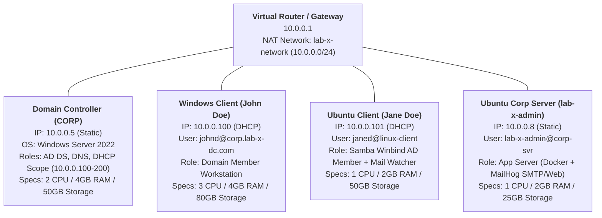

# Enterprise Active Directory & Linux Integration Lab (VirtualBox)

A comprehensive hands-on hybrid Active Directory lab environment built using Oracle VM VirtualBox. This project demonstrates enterprise identity management, cross-platform Linux domain integration via Kerberos & Samba Winbind, centralized DNS/DHCP infrastructure, and internal application services (Docker-hosted MailHog with automated Python/Bash notification pipelines).

---

## 🏛️ Lab Architecture & Network Topology




---


### Network & Subnet Summary

---

z

## 👥 Provisioned Systems & Accounts


| Hostname / Machine | OS                   | Hardware Specs                      | IP Address   | Account ID / UPN                  | Role / Services                                      |
| ------------------ | -------------------- | ----------------------------------- | ------------ | --------------------------------- | ---------------------------------------------------- |
| **CORP**           | Windows Server 2022  | 2 CPU / 4096 MB RAM / 50 GB Storage | `10.0.0.5`   | `Administrator@corp.lab-x-dc.com` | Primary Domain Controller, DNS, DHCP                 |
| **Windows Client** | Windows Client       | 3 CPU / 4096 MB RAM / 80 GB Storage | `10.0.0.100` | `johnd@corp.lab-x-dc.com`         | Domain-joined workstation (John Doe)                 |
| **linux-client**   | Ubuntu Desktop 22.04 | 1 CPU / 2048 MB RAM / 50 GB Storage | `10.0.0.101` | `janed@linux-client`              | Domain-joined Linux client (Jane Doe) + Mail Watcher |
| **corp-svr**       | Ubuntu Server 22.04  | 1 CPU / 2048 MB RAM / 25 GB Storage | `10.0.0.8`   | `lab-x-admin@corp-svr`            | Corporate Application Server (Docker + MailHog)      |


---


### Hardware & Virtual Machine Breakdown

1. **Domain Controller (**`CORP`**):**
  - **OS:** Windows Server 2022 (Windows Server 2025 ISO)
  - **Hardware Allocation:** 2 CPU Cores, 4096 MB (4 GB) RAM, 50 GB Storage
  - **IP Address:** `10.0.0.5` (Static)
2. **Windows Client (**`John Doe`**):**
  - **OS:** Windows Client
  - **Hardware Allocation:** 3 CPU Cores, 4096 MB (4 GB) RAM, 80 GB Storage
  - **IP Address:** `10.0.0.100` (DHCP Assigned)
3. **Ubuntu Desktop Client (**`linux-client` **/** `Jane Doe`**):**
  - **OS:** Ubuntu Desktop 22.04 LTS
  - **Hardware Allocation:** 1 CPU Core, 2048 MB (2 GB) RAM, 50 GB Storage
  - **IP Address:** `10.0.0.101` (DHCP Assigned)
4. **Ubuntu Corporate Server (**`corp-svr` **/** `lab-x-admin`**):**
  - **OS:** Ubuntu Server 22.04 LTS
  - **Hardware Allocation:** 1 CPU Core, 2048 MB (2 GB) RAM, 25 GB Storage
  - **IP Address:** `10.0.0.8` (Static / App Server)

---


## 🐧 Cross-Platform Linux Domain Integration (Samba Winbind + Kerberos)

Ubuntu Linux clients are joined to the Active Directory domain controller using **Kerberos (**`krb5-user`**)**, **Samba**, and **Winbind**, enabling centralized Active Directory authentication and automatic home directory creation for Linux sessions.

### Step 1: DNS Resolution & Kerberos Configuration

Ensure `/etc/resolv.conf` points directly to the Windows Domain Controller:

```ini
nameserver 10.0.0.5
search corp.lab-x-dc.com
```

Register the domain realm with `krb5-config` / `/etc/krb5.conf`:

```ini
[libdefaults]
    default_realm = CORP.LAB-X-DC.COM
    dns_lookup_realm = false
    dns_lookup_kdc = true
```


### Step 2: Samba & Winbind Configuration (`/etc/samba/smb.conf`)

Configure Samba for Active Directory Security (`ads`) mode and autorid mapping:

```ini
[global]
   kerberos method = secrets and keytab
   realm = CORP.LAB-X-DC.COM
   workgroup = CORP
   security = ads
   template shell = /bin/bash
   winbind enum groups = Yes
   winbind enum users = Yes
   winbind separator = +
   idmap config * : rangesize = 1000000
   idmap config * : range = 1000000-19999999
   idmap config * : backend = autorid
```


### Step 3: Name Service Switch Configuration (`/etc/nsswitch.conf`)

Enable Winbind for user and group lookups:

```text
passwd:         files systemd sss winbind
group:          files systemd sss winbind
```


### Step 4: Automatic Home Directory Generation & Domain Join

Enable PAM home directory creation:

```bash
sudo pam-auth-update --enable mkhomedir
```

Join the Linux client to the Windows Server Domain:

```bash
sudo net ads join -U Administrator
```

Restart and verify services:

```bash
sudo systemctl restart smbd nmbd winbind
wbinfo -u   # Lists AD domain users
wbinfo -g   # Lists AD domain groups
```

---


## 📧 Corporate Mail Infrastructure & Automation Pipeline

The server `corp-svr` (`10.0.0.8`) hosts a mock corporate mail pipeline using **Docker** and **MailHog** (SMTP on port `1025`, Web UI / API on port `8025`).

### 1. Python SMTP Test Email Dispatcher (`corp-svr`)

A Python script sends test transactional email notifications through the local MailHog SMTP relay:

```python
import smtplib
from email.message import EmailMessage

msg = EmailMessage()
msg.set_content("This is a test email from Ubuntu VM.")
msg["Subject"] = "Hello World from MailHog!"
msg["From"] = "corpserver@example.com"
msg["To"] = "user@example.com"

# Connect to MailHog SMTP service
with smtplib.SMTP("localhost", 1025) as server:
    server.send_message(msg)
```


### 2. Automated Mail Watcher & Polling Service (`janed@linux-client`)

On `linux-client` (`10.0.0.101`), Jane Doe runs an automated daemon script that polls the MailHog REST API v2 every 30 seconds, parses JSON payloads using `jq`, tracks seen message IDs, and alerts the user upon receiving new emails:

```bash
#!/bin/bash

MAILHOG_IP="10.0.0.8"  
TO_EMAIL="janed"
POLL_INTERVAL=30  # seconds

echo "📡 Janed's Mail Watcher started... polling every $POLL_INTERVAL seconds"
echo "🔎 Watching for new mail sent to: $TO_EMAIL@"

# Keep track of seen message IDs
SEEN_IDS_FILE="/tmp/mailhog_seen_ids_janed.txt"
touch "$SEEN_IDS_FILE"

while true; do
  # Fetch current message list from MailHog API
  curl -s http://$MAILHOG_IP:8025/api/v2/messages | jq -c '.items[]' | while read -r msg; do
    TO=$(echo "$msg" | jq -r '.To[].Mailbox')
    ID=$(echo "$msg" | jq -r '.ID')

    if [[ "$TO" == "$TO_EMAIL" && ! $(grep -Fx "$ID" "$SEEN_IDS_FILE") ]]; then
      SUBJECT=$(echo "$msg" | jq -r '.Content.Headers.Subject[0]')
      BODY=$(echo "$msg" | jq -r '.Content.Body')

      echo -e "\n📬 New Email Received!"
      echo "Subject: $SUBJECT"
      echo "From: $(echo "$msg" | jq -r '.Content.Headers.From[0]')"
      echo "Date: $(echo "$msg" | jq -r '.Created')"
      echo -e "Message:\n$BODY"
      echo "-----------------------------------"

      echo "$ID" >> "$SEEN_IDS_FILE"
    fi
  done

  sleep "$POLL_INTERVAL"
done
```

---


## 🔌 VirtualBox Network Adapter Modes Overview

VirtualBox provides several networking modes depending on how you want virtual machines to communicate with each other, the host machine, and the outside internet:

- **NAT (Network Address Translation):**
The default mode. The VM gets outbound internet access through the host's IP address, but external devices and other VMs cannot directly connect to it.
- **NAT Network:**
Creates an internal virtual router allowing multiple VMs assigned to the same NAT Network to communicate with one another while still having outbound internet access. *(Used for this lab)*.
- **Bridged Adapter:**
Connects the VM directly to the physical network of the host. The VM receives its own dedicated IP address from the physical network's router (e.g., home Wi-Fi router) and appears as a separate physical device on the local network.
- **Internal Network:**
Creates an isolated private network strictly between VMs on the same host. VMs can only talk to each other; they cannot access the host machine or the internet.
- **Host-Only Adapter:**
Creates a private network between the host machine and the VMs. VMs can talk to each other and the host, but have no access to the outside internet unless routed specifically.

---


## 🛡️ Active Directory Core Concepts


### The 3 Main Components of Active Directory

1. **Authentication:**
  Verifies identity (*"Who are you?"*). Checks user credentials via protocols like Kerberos and NTLM when logging into a domain machine or service.
2. **Authorization:**
  Determines permissions (*"What are you allowed to do?"*). Checks whether an authenticated user has rights to access specific folders, files, or administrative tools based on group memberships and access control lists (ACLs).
3. **Management:**
  Centralizes control of network objects (users, computers, printers, and organizational units) across the entire enterprise from a single administrative interface.

---


### Key Strengths of Active Directory

- **Centralized Management:** Administrators manage users, passwords, devices, and permissions across thousands of machines from one place rather than configuring each machine individually.
- **Scalability:** Easily grows from a small lab environment to large enterprise networks containing millions of objects across multiple sites and domains.
- **Group Policy (GPO):** Enforces security baselines, software installations, password policies, and desktop settings automatically across all domain-joined computers.
- **Seamless Service Integration:** Integrates natively with critical infrastructure services like DNS, DHCP, file shares, Certificate Services, and cloud platforms (Microsoft Entra ID / Office 365).

---


### Why Active Directory is a Prime Target for Attackers

- **"Keys to the Kingdom":** Gaining Domain Admin privileges gives attackers complete control over every domain-joined computer, server, and user identity across the entire organization.
- **High Privilege Consolidation:** AD stores sensitive credential hashes, Kerberos tickets, and privilege maps, making it a primary target for credential harvesting, lateral movement, and privilege escalation (e.g., Pass-the-Hash, Kerberoasting, Golden Ticket attacks).
- **Misconfiguration Exposure:** Because large Active Directory environments are complex and often accumulate legacy settings, weak permissions, and outdated protocols, attackers frequently find paths to escalate privileges.

---


## 💡 Key Skills & Technologies Demonstrated

- **Directory Services & Identity:** Windows Server 2022 AD DS, Kerberos Authentication, NTLM, Domain User Provisioning.
- **Cross-Platform Integration:** Linux/Ubuntu integration with Active Directory using Samba, Winbind, PAM (`mkhomedir`), and NSSwitch.
- **Enterprise Network Infrastructure:** VirtualBox NAT Networks, Static IP Assignment, Windows DHCP Scope Configuration, DNS forwarders and SRV records.
- **DevOps & Service Automation:** Docker container deployment (MailHog), Python SMTP automation, Bash daemon scripting with REST API consumption (`curl`, `jq`).

