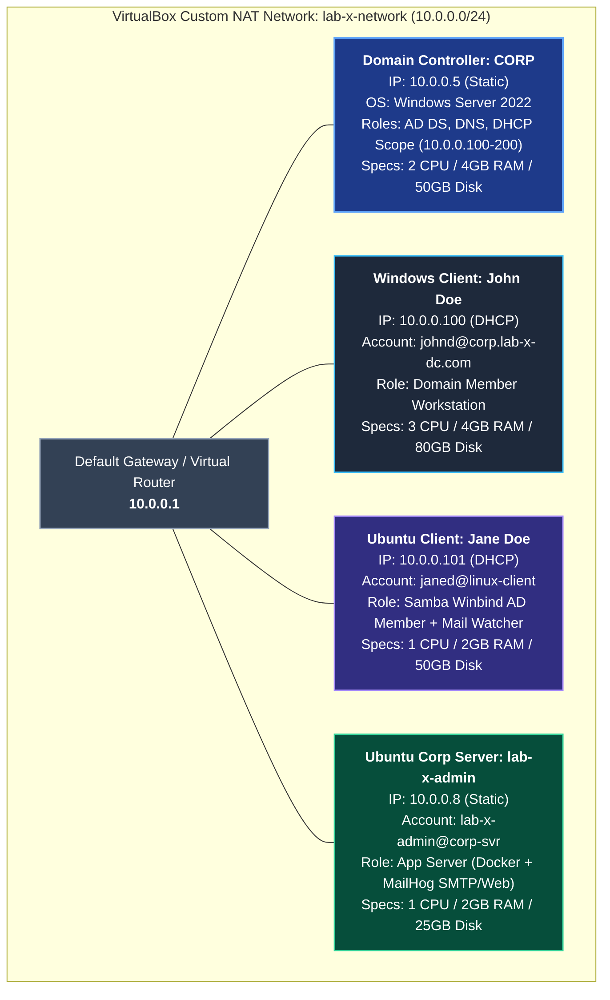

[5 lines collapsed]

## 🏛️ Lab Architecture & Network Topology

                                  [ lab-x-network ]
                             NAT Network: 10.0.0.0/24
                                Gateway: 10.0.0.1
                                        │
      ┌──────────────────┬──────────────┴───────────────┬──────────────────┐
      │                  │                              │                  │
┌─────▼──────────┐ ┌─────▼───────────────┐ ┌────────────▼──────┐ ┌─────────▼──────────────┐
│ Domain Cont.   │ │ Windows Client      │ │ Ubuntu Client     │ │ Ubuntu Corp Server     │
│ CORP           │ │ John Doe (johnd)    │ │ Jane Doe (janed)  │ │ lab-x-admin            │
│ 10.0.0.5       │ │ 10.0.0.100          │ │ 10.0.0.101        │ │ 10.0.0.8               │
│ AD DS, DNS,    │ │ Windows OS          │ │ Ubuntu Linux      │ │ Docker + MailHog       │
│ DHCP Server    │ │ Domain Member       │ │ Samba Winbind AD  │ │ (SMTP: 1025 / UI: 8025)│
└────────────────┘ └─────────────────────┘ └───────────────────┘ └────────────────────────┘
```
---
### 1. Domain Controller (DC)
- **Hostname:** `CORP`
- **Domain Name:** `lab-x-dc` (FQDN: `corp.lab-x-dc.com`)

[237 lines collapsed]
